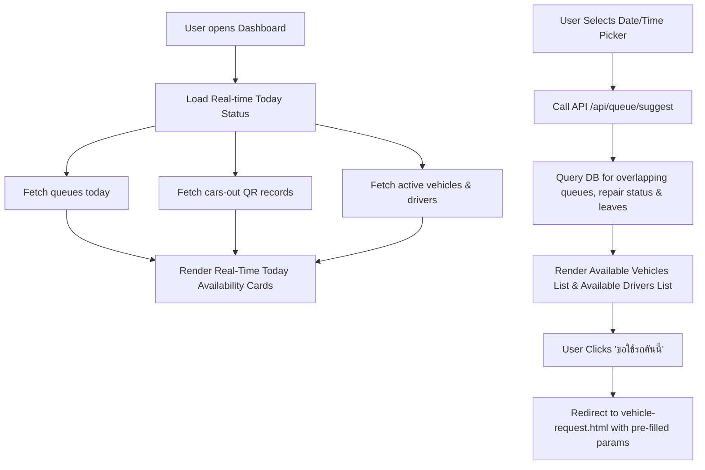

# Design Spec: Real-time Availability & Date-based Calendar Checker on Dashboard

**Date:** 2026-08-13  
**Target File:** `frontend/dashboard.html`, `functions/api/queue/suggest.js`, `frontend/js/api.js`  
**Goal:** Enhance the PPK DriveHub Dashboard (`dashboard.html`) to display real-time availability of vehicles and drivers for today, and provide an interactive date/time picker tool allowing users to check vehicle and driver availability for any selected date on the calendar.

---

## 1. Requirements Overview

1. **Real-time Today Availability (สถานะวันนี้แบบ Real-time)**:
   - Display live summary counts and cards for **Available Vehicles** and **Available Drivers** for today.
   - **Logic for Today Real-time:**
     - **Vehicles:** Active cars (`status NOT IN ('under_repair', 'retired', 'inactive')`) minus cars booked today in approved/scheduled/ongoing queues (`queue` where `date <= today AND return_date >= today AND status NOT IN ('cancelled', 'completed')`) minus cars currently checked out via QR scan without return scan (`cars-out` from `usage_records`).
     - **Drivers:** Active drivers (`status = 'active'`) minus drivers assigned today in approved/scheduled/ongoing queues minus drivers currently out on trips (`cars-out`) minus drivers on approved leave (`leaves`).

2. **Calendar Date/Time Availability Checker (เช็ครถ/คนขับว่างตามปฏิทิน)**:
   - Provide a date/time picker control on the Dashboard allowing users to pick a date (`date`), start time (`time_start`), and end time (`time_end`).
   - Defaults to Today's date with default time window (`08:00 - 17:00`).
   - When a user changes the date/time, the system queries the backend to fetch available vehicles and drivers for that specific time window.
   - **Logic for Date/Time Checker:**
     - Query `queue` table for approved/scheduled/ongoing requests overlapping the date/time range.
     - Query `leaves` table for driver leave overlaps.
     - Filter out cars under repair or inactive.
   - Provide a quick action button **"📝 ขอใช้รถคันนี้"** / **"📝 ขอใช้รถช่วงเวลานี้"** which pre-fills the details and redirects to `vehicle-request.html?v=2`.

---

## 2. Proposed System Architecture & Changes

### Component Details:

1. **`frontend/dashboard.html`**:
   - Add a prominent **Availability Checker Widget** section with:
     - Date Input (`#checkerDate`)
     - Time Start Input (`#checkerTimeStart`, default `08:00`)
     - Time End Input (`#checkerTimeEnd`, default `17:00`)
     - Reset / Today button
   - Render **Available Vehicles Card List**:
     - License Plate, Brand/Model, Vehicle Type badge, and "📝 ขอใช้รถคันนี้" button.
   - Render **Available Drivers Card List**:
     - Driver Name, Phone Number, and status badge.
   - Ensure the layout is clean, touch-friendly, and fully responsive on mobile devices.

2. **`functions/api/queue/suggest.js`**:
   - Enhance the `/api/queue/suggest` GET endpoint to accept `date`, `time_start`, `time_end`.
   - Return detailed lists of available cars (`available_cars`) and available drivers (`available_drivers`) alongside counts (`available_cars_count`, `available_drivers_count`).

3. **`frontend/js/api.js`**:
   - Add alias `checkAvailability: (d) => API.get('/api/queue/suggest' + _q(d))` in `ACTION_MAP`.

---

## 3. UI/UX Specification

- **Colors & Styles**: Follow PPK DriveHub modern design system (Kanit font, glassmorphism cards, `#6366f1` primary color, green `#10b981` badges for available, red `#ef4444` for busy/under repair).
- **Mobile Responsive**: Flex/Grid wrap layout for phone, tablet, and desktop screens.
- **Empty States**: If no cars or drivers are available, render clear informative empty messages with suggestions to adjust the time range.

---

## 4. Verification Plan

1. **Automated Testing**:
   - Execute Playwright E2E tests (`npm test`) to ensure page rendering, date picker changes, and routing function cleanly.
2. **Manual Verification**:
   - Test today's real-time count against existing active queues and `cars-out` records.
   - Test picking a future date and verifying available cars & drivers update instantly.
   - Test clicking "ขอใช้รถคันนี้" and confirming parameters pass to `vehicle-request.html`.
